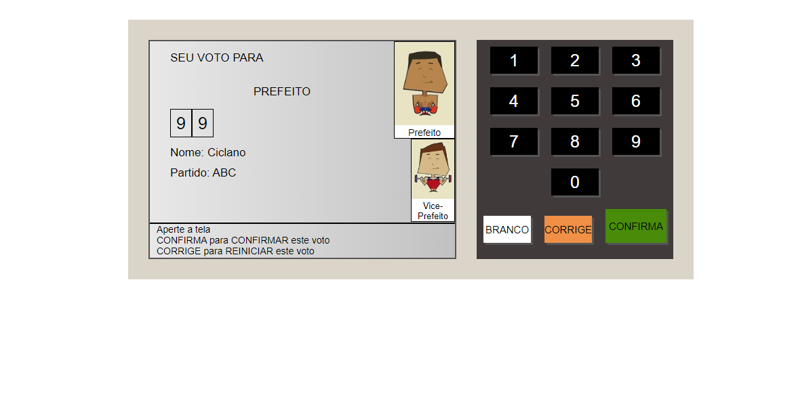

<h1 align="center">
Urna eleitoral
</h1>

<p align="center">Este projeto foi desenvolvido acompanhando a aula do professor Bonieky Lacerda </p>

<p align="center">
  
  <br/>
  <br/>
</p>

<hr>

<p align="center">
  
<p>

## Descrição
O projeto foi desenvolvido para fixa alguns conhecimentos, o proprio conta com um pequeno backend onde guarda as informações dos canditados e retorna os dados e os  exibi em tela, e conta com uma função para cada botão onde é possivel votar em branco, corrigir seu voto e confirmar o seu voto

## Tecnologias Utilizadas

- [X] Javascript
- [X] Html
- [X] Css


## :arrow_forward: Como executar

_com **npm**_

```bash
# Instalar dependências
$ npm install
# Iniciar servidor
$ npm start
```

_com **yarn**_

```bash
# Instalar dependências
$ yarn
# Iniciar servidor de desenvolvimento
$ yarn start
```
---
